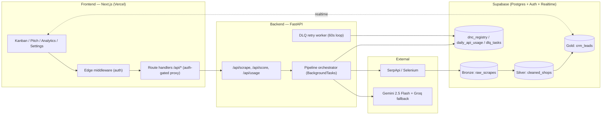

# 🏗️ CityPulse CRM Architecture

This document describes the high-level architecture of CityPulse CRM, an AI-powered lead generation CRM with a Medallion data pipeline.

## System Overview

CityPulse CRM consists of a Next.js frontend, a Python FastAPI backend, and a Supabase database (PostgreSQL). The core functionality revolves around a Medallion data pipeline (Bronze -> Silver -> Gold) that scrapes, cleans, and AI-scores business leads.

## Components

### 1. Frontend (Next.js 16 / React 19)
- **Role:** Provides the user interface for sales reps and admins.
- **Key Features:**
    - Real-time Kanban board (optimistic updates via Supabase Realtime).
    - AI Pitch Generator.
    - Analytics Dashboard.
    - Settings (DNC Registry management).
- **Communication:** Proxies requests to the FastAPI backend. It does not directly interact with external APIs (SerpApi, LLMs) for pipeline operations.

### 2. Backend (Python 3.11 / FastAPI)
- **Role:** Handles the core data pipeline, business logic, and interactions with external services.
- **Key Features:**
    - Exposes API endpoints (`/api/scrape`, `/api/score`, etc.).
    - Orchestrates the Medallion Data Pipeline using background tasks.
    - Manages a Dead Letter Queue (DLQ) for failed tasks.
    - Implements FinOps quotas and rate limiting.
- **Deployment:** Containerized (Docker).

### 3. Database (Supabase / PostgreSQL)
- **Role:** Stores all application data, user accounts, and pipeline state.
- **Key Features:**
    - Relational data storage (raw scrapes, cleaned leads, scored leads).
    - Authentication and authorization (Row-Level Security - RLS).
    - Real-time subscriptions for UI updates.
    - Stored procedures (RPCs) for atomic operations (e.g., usage quotas).

### 4. External Services
- **Scraping:** SerpApi (primary) with a Selenium fallback.
- **AI / LLMs:** Google Gemini 2.5 Flash (primary) with Groq Llama-3.3-70B as a free fallback for lead scoring and pitch generation.

## Data Pipeline: The Medallion Architecture

The core of the system is a three-tier data pipeline that processes raw local business data into high-quality leads.

| Layer | Table | Produced by | Responsibility |
|-------|-------|-------------|----------------|
| **Bronze** | `raw_scrapes` | `scraper/serpapi_client.py` | Capture raw scrape JSON verbatim. Serves as an immutable audit record. |
| **Silver** | `cleaned_shops` | `ai_pipeline/cleaner.py` | Normalize data (phone, website), filter against DNC (Do-Not-Contact) registry. Enforces data-quality gates via Pydantic (`CleanedShop`). |
| **Gold** | `crm_leads` | `ai_pipeline/scorer.py` | Assign AI heat-score and reasoning. Enforces data-quality gates via Pydantic (`ScoredLead`). Performs idempotent upserts based on `place_id`. |

### Pipeline Orchestration
- Orchestrated by `_run_full_pipeline` in `backend/main.py`.
- **Resilience:** Any step that fails is sent to the Dead Letter Queue (DLQ) instead of crashing the pipeline. A worker automatically retries failed tasks with exponential backoff.
- **Contracts:** Pydantic models act as strict contracts between layers. Bad rows are quarantined and never written downstream.
