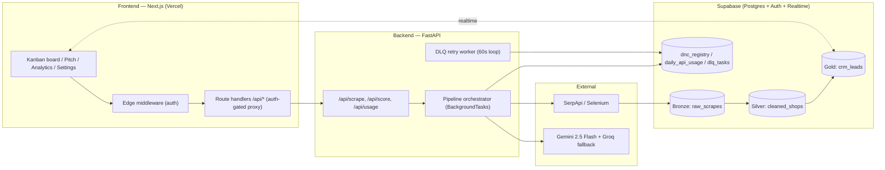

# CityPulse CRM

> An event-driven, AI-enriched lead-generation CRM built around a **Bronze → Silver → Gold medallion data pipeline**. Scrapes local-business data, cleans & compliance-filters it, scores each lead 0–100 with an LLM, and serves it to a real-time sales Kanban board.

This is a **data-engineering portfolio project**: the interesting part is the *pipeline* (ingestion → quality gates → enrichment → serving), its **resilience** (dead-letter queue, provider fallbacks), and its **cost controls** (FinOps quotas), not just the CRM UI.

> 📋 **How to use this doc:** the [Feature Inventory & Roadmap](#-feature-inventory--roadmap) section is a set of checklists. Tick / untick / strike-through items to say what you want **kept, added, or removed**, then hand it back and I'll implement the diff. Nothing below is set in stone.

---

## Table of Contents
1. [What it does](#what-it-does)
2. [Architecture](#architecture)
3. [Data flow: Bronze → Silver → Gold](#data-flow-bronze--silver--gold)
4. [Tech stack](#tech-stack)
5. [Data model](#data-model)
6. [Repository layout](#repository-layout)
7. [Security model](#security-model)
8. [Resilience & cost control](#resilience--cost-control)
9. [Local setup & run](#local-setup--run)
10. [Environment variables](#environment-variables)
11. [Project status](#project-status)
12. [Feature inventory & roadmap](#-feature-inventory--roadmap)
13. [Design decisions & trade-offs](#design-decisions--trade-offs)
14. [Known limitations](#known-limitations)

---

## What it does

1. An admin triggers a **scrape** for a `city` + `niche` (e.g. "restaurants in Kochi").
2. The backend pulls business listings (SerpApi, with a best-effort Selenium fallback) and stores the raw payload (**Bronze**).
3. The data is **cleaned**, normalized, and filtered against a Do-Not-Contact registry (**Silver**).
4. An LLM assigns each business a **Heat Score (0–100)** — how likely they need web/marketing help — with a reason (**Gold**).
5. Scored leads stream into a **real-time Kanban board**; reps drag leads through `new → contacting → won / lost` and generate AI cold-outreach pitches.

The "heat score" thesis: a business with **no website**, **poor SEO**, or **low ratings** is a hot lead for digital services.

---

## Architecture



**Two deployables:** the **frontend** (Next.js, deploys to Vercel) and the **backend** (FastAPI, runs locally / on a container host). The frontend never talks to external scrapers/LLMs for pipeline work — it proxies to the backend, which holds the privileged keys.

---

## Data flow: Bronze → Silver → Gold

| Layer | Table | Produced by | Responsibility |
|-------|-------|-------------|----------------|
| **Bronze** | `raw_scrapes` | `backend/scraper/serpapi_client.py` | Capture the raw scrape JSON verbatim (schemaless on purpose — an immutable audit record). |
| **Silver** | `cleaned_shops` | `backend/ai_pipeline/cleaner.py` | Normalize phone/website, extract fields, **DNC compliance filter**, **data-quality gate** (Pydantic `CleanedShop` contract); quarantine bad rows. |
| **Gold** | `crm_leads` | `backend/ai_pipeline/scorer.py` | LLM heat-score + reasoning, **DQ gate** (`ScoredLead` contract), idempotent upsert keyed on `place_id`. |

Orchestrated by `_run_full_pipeline` in `backend/main.py` (scrape → clean → score). Any step that fails goes to the **Dead Letter Queue** instead of crashing the pipeline.

---

## Tech stack

| Area | Choice |
|------|--------|
| Backend | Python 3.11, FastAPI, Uvicorn, Pydantic v2 / pydantic-settings |
| Frontend | Next.js 16, React 19, TypeScript, Turbopack |
| UI | Tailwind, dnd-kit (drag/drop), TanStack Query, Zustand, react-hook-form + Zod, sonner |
| Database | Supabase (Postgres + Auth + Realtime), Row-Level Security, PL/pgSQL RPCs |
| Scraping | SerpApi (primary), Selenium headless (best-effort fallback) |
| LLM | Google Gemini 2.5 Flash (primary) + Groq Llama-3.3-70B (free fallback) |
| CI | GitHub Actions (lint, build, black, pytest); Vercel preview deploys |

---

## Data model

```
raw_scrapes (Bronze)
  id PK · raw_data JSONB · city · niche · source · scraped_at · created_by→auth.users

cleaned_shops (Silver)
  place_id PK · shop_name · phone · website · address · city · niche
  · lat_lng POINT · rating(0-5) · review_count · is_active · raw_scrape_id→raw_scrapes

crm_leads (Gold)
  id PK · place_id UNIQUE →cleaned_shops · heat_score(0-100) · reasoning
  · status(new|contacting|won|lost) · assigned_to→auth.users · pitch_script
  · column_order · created_at · updated_at

dnc_registry        phone UNIQUE · website_domain UNIQUE · reason            (compliance blocklist)
daily_api_usage     date PK · gemini_calls · scraper_runs                   (FinOps counters)
dlq_tasks           task_id PK · task_type · payload JSONB · retry_count · status · next_retry_at
```

**Functions / triggers:** `is_admin()` (reads `app_metadata.role`), `increment_gemini_calls()` / `increment_scraper_runs()` (atomic quota RPCs), `set_default_app_role()` (defaults new users to `sales_rep`), `update_updated_at_column()`. Canonical DDL lives in `project-docs/schema.sql` + `project-docs/rls_policies.sql`; incremental changes in `supabase/migrations/`.

---

## Repository layout

```
backend/
  main.py                  FastAPI app, endpoints, DLQ retry worker, pipeline orchestrator
  config.py                pydantic-settings (env), prod secret guard
  scraper/serpapi_client.py    SerpApi + best-effort Selenium fallback (Bronze)
  ai_pipeline/cleaner.py       Silver: normalize + DNC + DQ gate
  ai_pipeline/scorer.py        Gold: Gemini/Groq scoring + DQ gate + upsert
  ai_pipeline/contracts.py     Pydantic data contracts (CleanedShop, ScoredLead)
  database/{supabase_client,finops,dlq}.py
  tests/                   pytest (finops, dlq, contracts, scraper, health)
frontend/
  app/(auth)/{login,signup}        Supabase auth
  app/dashboard/{page,analytics,settings}   Kanban, analytics, DNC registry
  app/api/{scrape,usage,generate-pitch}     auth-gated route handlers
  components/kanban/*               board, card, column, pitch generator, modal
  lib/supabase/*, lib/auth/*        clients + route auth helper
project-docs/              schema.sql, rls_policies.sql (canonical DDL)
supabase/migrations/       incremental SQL migrations
files/                     runbooks / handoff notes
```

---

## Security model

- **Auth:** Supabase email/password. Edge middleware guards `/dashboard`; the `/api/*` route handlers each require a valid session (no anonymous quota-burning).
- **Authorization:** Row-Level Security on every table. Admin = `auth.jwt() -> app_metadata.role == 'admin'`. **`app_metadata` is server-set only** (never `user_metadata`, which the user can edit) — closes the self-promotion hole. Sales reps see assigned + unassigned leads and claim-on-drag.
- **Secrets:** service-role key only on the backend; frontend uses the anon key in the browser + a server-only `BACKEND_API_KEY` for the proxy. All real secrets are gitignored. Backend refuses to boot in `APP_ENV=production` with a default/blank API key.
- **Compliance:** DNC registry cross-checked at the Silver layer; blocked leads never advance.

---

## Resilience & cost control

- **Dead Letter Queue** (`dlq_tasks`): failed scrape/clean/score tasks are enqueued and retried by a 60s background worker with exponential backoff (30s→480s, max 5). Retries never double-enqueue; quota exhaustion is terminal.
- **Provider fallbacks:** Gemini → Groq (free) on any LLM error/quota; SerpApi → Selenium (best-effort) on scraper failure.
- **FinOps quotas:** atomic Postgres RPCs cap Gemini calls and scraper runs per day; the Analytics page shows a live budget meter.
- **Data quality gates:** rows failing the Silver/Gold contracts are quarantined, never written downstream.

---

## Local setup & run

**Prerequisites:** Python 3.11, Node 20+, a Supabase project.

```bash
# 1. Backend
cd backend
python3.11 -m venv ../.venv && source ../.venv/bin/activate
pip install -r requirements.txt
cp .env.example .env        # fill in values (see below)

# 2. Apply DB schema (Supabase SQL Editor or psql)
#    project-docs/schema.sql  → project-docs/rls_policies.sql  → supabase/migrations/*

# 3. Run backend (from repo root)
uvicorn backend.main:app --reload      # http://localhost:8000/api/health

# 4. Frontend
cd frontend
npm install
cp .env.local.example .env.local   # if present; else create (see below)
npm run dev                        # http://localhost:3000

# Tests / quality
python -m pytest backend/tests -q
cd frontend && npm run lint && npm run build
```

Log in with an admin account (admin role must be set in `app_metadata` via the service role).

---

## Environment variables

**`backend/.env`**

| Var | Purpose |
|-----|---------|
| `SUPABASE_URL`, `SUPABASE_SERVICE_ROLE_KEY` | Supabase (server-side, privileged) |
| `SERPAPI_KEY` | SerpApi scraper |
| `GEMINI_API_KEY` | Gemini LLM |
| `GROQ_API_KEY`, `GROQ_MODEL` | Free LLM fallback |
| `BACKEND_API_KEY` | Shared secret with the frontend proxy |
| `APP_ENV` | `development` / `production` (prod blocks default API key) |
| `MAX_GEMINI_CALLS_PER_DAY`, `MAX_SCRAPER_RUNS_PER_DAY` | FinOps caps |
| `CORS_ORIGINS`, `HOST`, `PORT` | Server |

**`frontend/.env.local`**

| Var | Purpose |
|-----|---------|
| `NEXT_PUBLIC_SUPABASE_URL`, `NEXT_PUBLIC_SUPABASE_ANON_KEY` | Browser Supabase client |
| `NEXT_PUBLIC_BACKEND_URL`, `NEXT_PUBLIC_GEMINI_DAILY_LIMIT` | UI |
| `BACKEND_URL`, `BACKEND_API_KEY` | Server-only proxy to backend |
| `GEMINI_API_KEY`, `GOOGLE_GENERATIVE_AI_API_KEY`, `GROQ_API_KEY`, `GEMINI_MODEL`, `GROQ_MODEL` | Pitch route LLM |

---

## Project status

### ✅ Phase 1 — critical fixes (done, merged)
- [x] Green CI baseline (pytest-mock, conftest, black, pytest.ini)
- [x] Auth-gate all `/api/*` routes + fail-closed prod secret guard + tighter CORS
- [x] Kill admin privilege escalation (`is_admin()` → `app_metadata`, default-role trigger)
- [x] Fix Kanban drag for sales reps (claim-on-move satisfies RLS)
- [x] DLQ: no duplicate re-enqueue on retry + async-safe DB calls
- [x] Prevent duplicate leads (`UNIQUE(place_id)` + idempotent upsert)
- [x] Honest Selenium fallback + removed dead code
- [x] Gemini → Groq free-tier fallback (scoring + pitch)

### 🔧 Phase 2 — data-engineering depth (in progress)
- [x] **Data quality** — typed contracts + Silver/Gold gates + tests
- [ ] **Observability + cost** — `pipeline_runs`/`pipeline_metrics` tables, per-layer rows in/out/filtered, LLM token+cost, `/api/metrics` + `/api/dlq/status`, structured logging
- [ ] **Orchestration** — replace FastAPI BackgroundTasks with Prefect (scheduling, backfill, retries, run UI)
- [ ] **Reproducibility + docs** — docker-compose, seed data, this README, `Makefile`, schema migrations tool (Alembic / Supabase CLI)

---

## 📋 Feature inventory & roadmap

> Edit these checklists to drive the build. **Keep** = leave checked, **remove** = strike or delete, **add** = check an idea below or write your own. Hand it back and I'll implement the diff (one PR per item).

### Currently implemented (keep / remove?)
- [x] City + niche scraping (SerpApi primary)
- [x] Selenium fallback scraper *(brittle, non-serverless — keep or drop?)*
- [x] Medallion pipeline Bronze → Silver → Gold
- [x] DNC compliance filtering
- [x] AI heat scoring (Gemini + Groq fallback)
- [x] Real-time Kanban board (drag/drop, optimistic UI)
- [x] AI cold-outreach pitch generator (streaming)
- [x] Analytics dashboard (pipeline funnel + FinOps budget meter)
- [x] DNC registry management (Settings)
- [x] Dead-letter queue + retry worker
- [x] FinOps daily quotas

### Candidate features to add (tick what you want)
**Pipeline / DE**
- [ ] Pipeline run history + lineage (`pipeline_runs` table + UI)
- [ ] Per-layer & cost metrics dashboard ($/1000 leads, token spend)
- [ ] Scheduled / recurring scrapes (cron) + backfill
- [ ] Incremental scraping with watermarks (skip recently-scraped city/niche)
- [ ] Bronze partitioning + retention policy
- [ ] SCD-style history for re-scored leads (heat-score over time)
- [ ] Golden-set evaluation for heat-score quality (track accuracy)
- [ ] dbt models for Silver/Gold (lineage, tests, docs)

**Product / CRM**
- [ ] Bulk actions (multi-select leads, bulk status change)
- [ ] Lead notes / activity timeline
- [ ] Direct WhatsApp / email send from a lead (not just copy)
- [ ] CSV / Sheets export of leads
- [ ] Multi-user assignment + team views / leaderboards
- [ ] Saved filters & search across leads
- [ ] Email notifications (new hot leads, daily digest)
- [ ] Lead deduplication across re-scrapes (fuzzy match)

**Platform**
- [ ] docker-compose one-command demo + seed data
- [ ] Frontend tests (Vitest/RTL) + pipeline integration tests
- [ ] Rate limiting on scrape/pitch endpoints
- [ ] Audit log table (who did what)
- [ ] Webhooks / public API for integrations

### Ideas to consider removing / simplifying
- [ ] Selenium fallback (rarely works headless, can't run serverless)
- [ ] `column_order` field (drag doesn't persist intra-column order yet)
- [ ] Duplicate FinOps fallback path (non-atomic; rely on the RPC only)

---

## Design decisions & trade-offs

- **Medallion architecture** keeps raw data immutable (replayable) and separates concerns (ingest vs clean vs enrich vs serve).
- **LLM as a transformation step** is powerful but non-deterministic and costs money → mitigated with low temperature, JSON-mode, FinOps quotas, a free fallback, and DQ gates on the output.
- **FastAPI BackgroundTasks** were chosen for simplicity; they're ephemeral (lost on restart) — Phase 2 moves orchestration to Prefect for durability/scheduling.
- **Pydantic contracts** (not pandera/Great Expectations) because the pipeline is dict-based, not DataFrame-based; same DQ intent, lighter fit.
- **Supabase** gives Postgres + Auth + Realtime + RLS in one, so the serving layer (Kanban) updates live with no custom websocket code.

---

## Known limitations

- Orchestration is in-process (no scheduler/backfill yet) — Phase 2.
- No run-level observability / lineage yet — Phase 2.
- Selenium fallback is best-effort and won't run on serverless hosts; SerpApi is the supported scraper.
- No frontend tests yet; backend tests cover contracts/finops/dlq but not full pipeline integration.
- Schema applied semi-manually (canonical SQL + migrations); a migration tool is a Phase 2 item.
```
